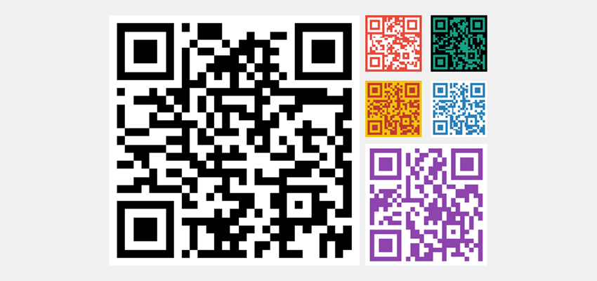

# QRCode 🔳

[](https://travis-ci.org/aschuch/QRCode)


A QRCode generator written in Swift.



## Usage

Create a new QRCode representing a `NSURL`, a string or arbitrary data.
The following examples all result in the same QRCode image.

```swift
// NSURL
let url = NSURL(string: "http://schuch.me")
qrCode = QRCode(url)
qrCode?.image

// String
let qrCode = QRCode("http://schuch.me")
qrCode?.image

// NSData
let data = "http://schuch.me".dataUsingEncoding(NSISOLatin1StringEncoding)
let qrCode = QRCode(data)
qrCode.image
```

### Customize the output image

> Make sure to declare your `QRCode` instance as a variable in order make use of the following features.

**Adjust Output Size**

Change the output size of the QRCode output image via the `size` property.

```swift
qrCode.size = CGSize(width: 300, height: 300)
qrCode.image // UIImage (300x300)
```

**Color**

Modify the colors of the QRCode output image via `color` and `backgroundColor` properties.

```swift
qrCode.color = CIColor(rgba: "16a085")
qrCode.backgroundColor = CIColor(rgba: "000")
qrCode.image // UIImage (green QRCode color and black background)
```

> **Note**: The obove examples make use of the `CIColor` extension that ships with this project to create colors based on HEX strings. 

### UIImageView extension

For convenience, a `UIImageView` extension is provided to directly initialize an image view with an instance of `QRCode`.

```swift
let imageView = UIImageView(qrCode: qrCode)
```

### Emoji alias

In case you love emoji as much as I do, make sure to create your `QRCode` instance using the 🔳 typealias.

```swift
let qrCode = 🔳("http://example.com")
``` 

## Installation

#### Carthage

Add the following line to your [Cartfile](https://github.com/Carthage/Carthage/blob/master/Documentation/Artifacts.md#cartfile).

```
github "aschuch/QRCode"
```

Then run `carthage update`.

#### Cocoapods

Add the following line to your Podfile.

```
pod "QRCode", "~> 0.5"
```

Then run `pod install` with Cocoapods 0.36 or newer.

#### Manually

Just drag and drop the three `.swift` files in the `QRCode` folder into your project.

## Tests

Open the Xcode project and press `⌘-U` to run the tests.

Alternatively, all tests can be run from the terminal using [xctool](https://github.com/facebook/xctool).

```bash
xctool -scheme QRCodeTests -sdk iphonesimulator test
```

## Todo

* Snapshot Tests
* Support transparent backgrounds

## Contributing

* Create something awesome, make the code better, add some functionality,
  whatever (this is the hardest part).
* [Fork it](http://help.github.com/forking/)
* Create new branch to make your changes
* Commit all your changes to your branch
* Submit a [pull request](http://help.github.com/pull-requests/)


## Contact

Feel free to get in touch.

* Website: <http://schuch.me>
* Twitter: [@schuchalexander](http://twitter.com/schuchalexander)
