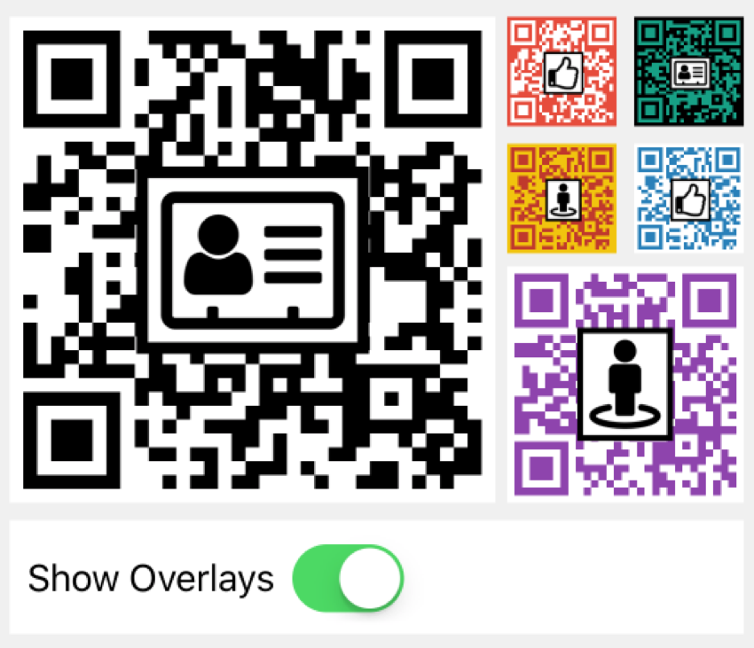

# QRCode 🔳

[](https://travis-ci.org/aschuch/QRCode)


A QRCode generator written in Swift.


## Overview

Create a new QRCode representing a `URL`, a string or arbitrary data.
The following examples all result in the same QRCode image.

```swift
// URL
let url = URL(string: "http://schuch.me")!
let qrCode = QRCode(url)
qrCode?.image

// String
let qrCode = QRCode("http://schuch.me")
qrCode?.image

// NSData
let data = "http://schuch.me".data(using: .isoLatin1)!
let qrCode = QRCode(data)
qrCode.image
```

### Customize the output image

> Make sure to declare your `QRCode` instance as a variable in order make use of the following features.

**Adjust Output Size**

Change the output size of the QRCode output image via the `size` property.

```swift
qrCode.size = CGSize(width: 300, height: 300)
qrCode.image // UIImage (300x300)
```

**Color**

Modify the colors of the QRCode output image via `color` and `backgroundColor` properties.

```swift
qrCode.color = CIColor(rgba: "16a085")
qrCode.backgroundColor = CIColor(rgba: "000")
qrCode.image // UIImage (green QRCode color and black background)
```

> **Note**: The above examples make use of the `CIColor` extension that ships with this project to create colors based on HEX strings. 

**Error Correction**

QR codes support a configurable error correction setting. This controls how much of the generated image can be damaged or occluded, while still allowing for the code to be recognized correctly.

To set error correction:

```swift
qrCode.errorCorrection = .High
```

If you do not declare this property, the default will be `.Low`.

Valid values and the corresponding error correction ability are:

| Parameter Val | Correction Ability |
| ------------- | ------------------ |
| Low	        | Approx 7%          |
| Medium	    | Approx 15%         |
| Quartile      | Approx 25%         |
| High          | Approx 30%         |

> For more information on Error Correction, see [QRcode.com](http://www.qrcode.com/en/about/error_correction.html).

*Why would you want higher error correction?*

Setting error correction above the default of Low allows you to create a QR code that can be damaged or covered but still scanned correctly. This allows for wear (if on a printed code) but also allows the use of graphics on top of the code. Therefore, QR codes can include a logo or other branding right over the qr code image (covering a part of it) and still will work. Note, however, that a higher amount of error correction also means that the QR code will be more "dense" (and therefore limits how small it might be printed/displayed.)

### Overlay Image Support

Since QRCodes have a tolerance for "error" (see error-correction elsewhere in this document), we are able to use this in order to drop in an overlay image while still allowing the QRCode to be decodable.



To add an optional overlay to your QRCode:

```swift
qrCode.errorCorrection = .High // or Quartile
qrCode.overlayImage = UIImage(named: "thumbs-up")
qrCode.overlayImagePercentage = 0.5
```

Note that its important that you set errorCorrection to .High, otherwise the overlay might be too small to be useful!

The overlayImage:

* should be sized no smaller than the QRCode size you intend to use (it will be sized down further to accommodate for the error correction tolerance)
* should be pre-colored to suit your needs since it will not be colored or tinted. You should should have good contrast with the QRCode color and background
* it should not have any alpha (transparency), except perhaps on the edges, otherwise the QRCode will bleed through the alpha areas
* you might want to have a stroke around the border to help it stand out

**overlayImagePercentage**

The size of the overlay will be calculated based on the size of the QRCode, the error correction tolerance and the `overlayImagePercentage` property. It turns out that the error correction estimates are definitely approximations that will vary with QRCode size and the data density of the QRCode. Therefore, through testing, we noticed that it's generally not possible to cover the QRCode as much as the error correction table states. This parameter says "how much" of the error correction area should be used.

For instance, a value of 0.5 with an `errorCorrection` value of `.High` indicates that the overlay should take no more than 15% of the total area of the QRCode (.High = 30% tolerance * 50% = 15%).

Through testing we noticed that the smaller the QRCode, the lower the percentage should be. For instance for the small QRCodes in the example, we had a better experience using `.50` whereas for larger QRCodes, we were able to use `.70`.

### UIImageView extension

For convenience, a `UIImageView` extension is provided to directly initialize an image view with an instance of `QRCode`.

```swift
let imageView = UIImageView(qrCode: qrCode)
```

### Emoji alias

In case you love emoji as much as I do, make sure to create your `QRCode` instance using the 🔳 typealias.

```swift
let qrCode = 🔳("http://example.com")
```

## Version Compatibility

Current Swift compatibility breakdown:

| Swift Version | Framework Version |
| ------------- | ----------------- |
| 3.0	        | 2.x          		|
| 2.3	        | 1.x          		|
| 2.2           | 0.x          		|

[all releases]: https://github.com/aschuch/QRCode/releases

## Installation

#### Carthage

Add the following line to your [Cartfile](https://github.com/Carthage/Carthage/blob/master/Documentation/Artifacts.md#cartfile).

```
github "aschuch/QRCode"
```

Then run `carthage update`.

#### Cocoapods

Add the following line to your Podfile.

```
pod "QRCode"
```

Then run `pod install` with Cocoapods 0.36 or newer.

#### Manually

Just drag and drop the three `.swift` files in the `QRCode` folder into your project.

## Tests

Open the Xcode project and press `⌘-U` to run the tests.

Alternatively, all tests can be run from the terminal using [xctool](https://github.com/facebook/xctool).

```bash
xctool -scheme QRCodeTests -sdk iphonesimulator test
```

## Todo

* Snapshot Tests
* Support transparent backgrounds

## Contributing

* Create something awesome, make the code better, add some functionality,
  whatever (this is the hardest part).
* [Fork it](http://help.github.com/forking/)
* Create new branch to make your changes
* Commit all your changes to your branch
* Submit a [pull request](http://help.github.com/pull-requests/)


## Contact

Feel free to get in touch.

* Website: <http://schuch.me>
* Twitter: [@schuchalexander](http://twitter.com/schuchalexander)
